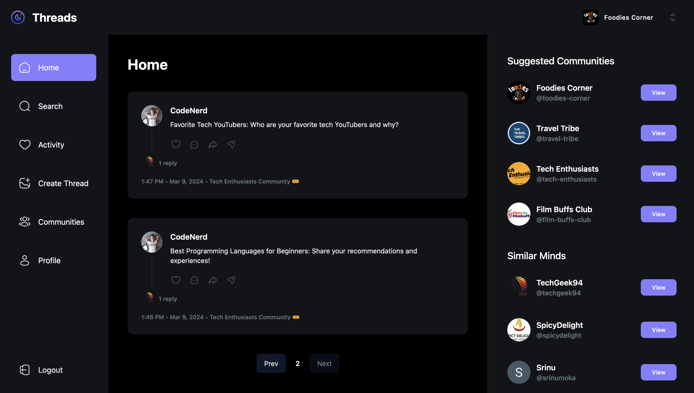

<div align="center">
  <br />
  
  <br />

  <div>
    
    
    
    
    
  </div>

  <h3 align="center">Threads App</h3>
</div>

## 📋 <a name="table">Table of Contents</a>

1. 🤖 [Introduction](#introduction)
2. ⚙️ [Tech Stack](#tech-stack)
3. 🚀 [Over View](#over-view)
4. 🔋 [Features](#features)
5. 🤸 [Quick Start](#quick-start)

## <a name="introduction">🤖 Introduction</a>

Your go-to app for dynamic threaded discussions! Seamlessly create and share engaging content threads on diverse topics. Stay connected with our activity section, notifying you of replies and interactions. Effortlessly find and connect with users through our intuitive search feature. Explore vibrant communities or create your own, all within the Threads app. Dive into meaningful conversations today!

## <a name="tech-stack">⚙️ Tech Stack</a>

- Next.js
- TypeScript
- MongoDB
- Clerk
- Upload Thing
- Zod
- React Hook Form
- Shadcn
- TailwindCSS

## <a name="over-view">🚀 Over View</a>

- Master Next.js 14 with Server Side Rendering
- Learn MongoDB handling of complex schemas, multiple data population
- Create beautiful layouts with TailwindCSS
- Use Clerk for authentication
- Handle file uploads with UploadThing
- Explore Shadcn components
- Listen to real-time events with webhooks
- Understand middleware, API actions, and authorization
- Explore & integrate new Next.js layout route groups
- Validate data with Zod
- Manage forms with react hook form
- Create reusable components
- Build a solid application architecture

## <a name="features">🔋 Features</a>

👉 **Authentication and Authorization**: Secure user access with registration, login, and route protection.

👉 **Home Page**: Discover and explore threads from your connections and communities on the centralized home feed.

👉 **Activity Section**: Stay updated on thread interactions, including replies and engagements.

👉 **User Search**: Connect with friends and like-minded individuals through easy user search functionality.

👉 **Communities**: Join or create groups based on shared interests, participate in discussions, and connect with others. View community profiles containing all threads, members, and requests for comprehensive engagement.

👉 **Profile Management**: Access user details, created threads, replies, and tagged content, with the ability to delete user-created threads for content control and management.

👉 **Responsive UI/UX**: A seamless experience across devices with a user-friendly interface

and many more, including code architecture and reusability


## <a name="quick-start">🤸 Quick Start</a>

Follow these steps to set up the project locally on your machine.

**Prerequisites**

Make sure you have the following installed on your machine:

- [Git](https://git-scm.com/)
- [Node.js](https://nodejs.org/en)
- [npm](https://www.npmjs.com/) (Node Package Manager)

**Cloning the Repository**

```bash
git clone https://github.com/MokaSrinu/sm-threads.git
cd imaginify
```

**Installation**

Install the project dependencies using yarn:

```bash
yarn install
```

**Set Up Environment Variables**

Create a new file named `.env.local` in the root of your project and add the following content:

```env
NEXT_CLERK_WEBHOOK_SECRET=
NEXT_PUBLIC_CLERK_PUBLISHABLE_KEY=
CLERK_SECRET_KEY=

NEXT_PUBLIC_CLERK_SIGN_IN_URL=
NEXT_PUBLIC_CLERK_SIGN_UP_URL=
NEXT_PUBLIC_CLERK_AFTER_SIGN_IN_URL=
NEXT_PUBLIC_CLERK_AFTER_SIGN_UP_URL=

MONGODB_URL=
UPLOADTHING_SECRET=
UPLOADTHING_APP_ID=
```

Replace the placeholder values with your actual respective account credentials.

**Running the Project**

```bash
yarn run dev
```

Open [http://localhost:3000](http://localhost:3000) in your browser to view the project.